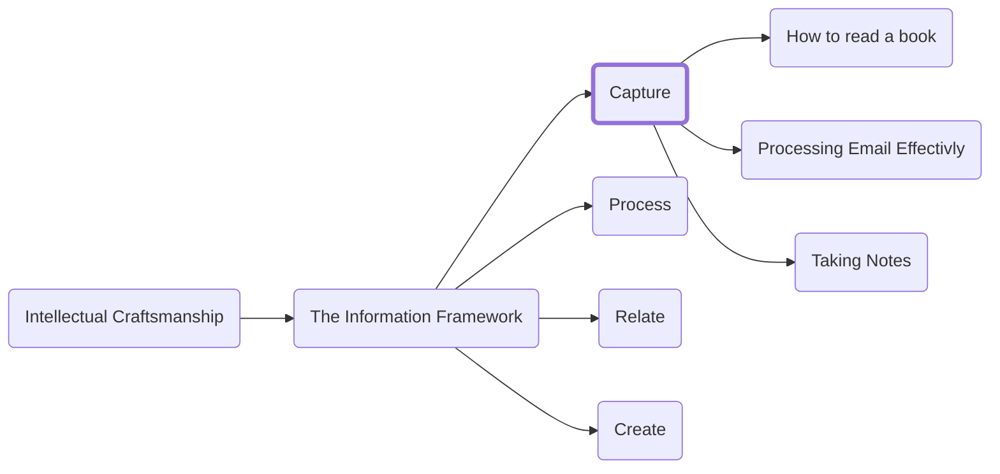

You use to-do lists, reminders, alarms, and calendars to remind you of what you need to do, buy, and accomplish. All too often though, despite this wealth of options, we fall back to relying on our brains for capturing key information. Your brain is an inefficient tool to use for storing information. It is lossy and it can be difficult to connect ideas especially across time.

By building a habit of capturing information outside your brain you not only offload the information but also reduce the stress around needing to keep the ideas top of mind (what David Allen calls your "Psychic RAM"). As much as possible you want to offload the cognitive load you are carrying with you to allow you to focus on more interesting thoughts and problems rather than wasting brain power remembering you must stop by the dry cleaners after work. If you ever have a nagging feeling that you are forgetting something, then that is an indication that you do not have an optimal process.

An optimal system is one we trust. For instance, if you put something in your calendar (at least for most professionals) there is an extremely high likelihood that you will remember to do that thing, on that day, at the prescribed time. What building a successful capture habit requires is building additional tools you can confidently rely on to store other sorts of information that are not time or location based.

Crucially, you must be able to capture the task, thought, or thing you have learned quickly enough that you do not have time to store it in your memory so you can keep your brain focused on the interesting problems.

There are three main categories of information you will be taking in and we will discuss systems for archiving all three in the '__Process__' section.
1.	__Time-based__: E.G., A meeting next Tuesday at 9AM or a reminder to re-balance your stock portfolio once a quarter.
2.	__Tasks__: Whether you produce a new piece of work for yourself or are asked by someone else you need a way to track work and some way to enforce both “do dates” and “due dates.”
3.	__Reference__: Some information is not actionable in a specific timeline but is valuable to capture so it can be contextualized and recalled later.

Before anything lands in those archival systems you need several fast-capture inboxes to allow you to rapidly gather external asks, information, invites, etc., store them, and subsequently get them off your mind.

The goal with capture is not to be discerning. The bar for including something is that it might be relevant at some point in the future. You will decide on both whether it is relevant and what category/archival system is best fit to store it long term later when you do active processing of your inboxes. For now, just get the ideas on paper. Your inbox is purely there to capture those ideas and let you get back to whatever you were doing when it came up.

The goal is to capture enough information to cover the core concept and a reference to the original source in case you need to refresh your memory of the broader context. While I do not have a super specific suggestion on how granular to be, you will quickly discover a level of specificity that works for you as you run through a few feedback loops of capture and process.

A good inbox gives you a way (that you trust) that you can collect information. That could be a notes app on your phone, a pen and paper in your pocket or recording of your voice or some combo of the above. What1ever system(s) you choose make sure it is always available. The keys to a successful inbox are availability and trust (knowing you will review it often enough not to miss something important.) If you do not have the capture tool with you when you need it, it is of no good to you no matter how “optimized” it is. When we talk about effective calendaring in the ‘Managing your Time’ section we will cover how to build a regular processing block into your schedule to help build trust in your systems.

In the rest of this section, we will talk about how to capture information from specific kinds of inputs.

<h3>Navigation</h3>

