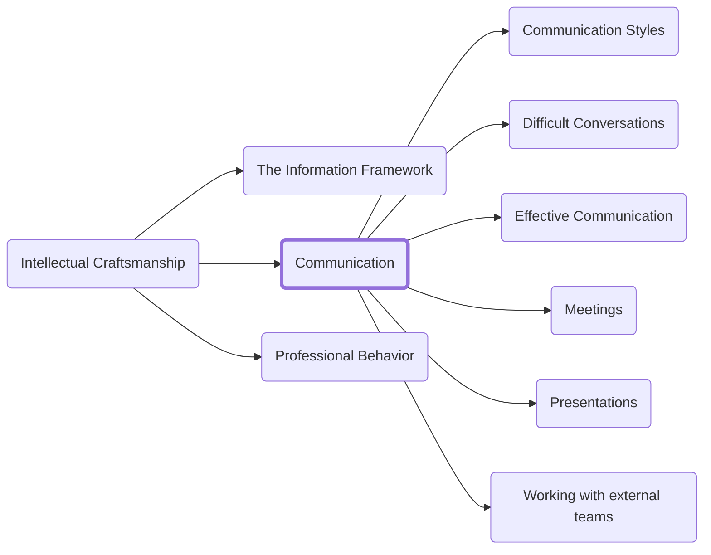

Learning to communicate your ideas to others in a way that they can understand is essential. You can be the smartest technical mind of your generation and if you lack the ability to help others understand your insights its all but worthless. In this section we will cover a number of different kinds of communication.

In this section we will cover:

- How different people naturally communcate and how you can deliver your message in a way that will be understood
- Ways to hone your message for clarity and impact
- How to communicate in difficult situations when emotions are high
- Specific forums for communication like:
  - How to deliver a presentation
  - How to communicate in, attend, and run an effective meeting

<h3>Navigation</h3>

