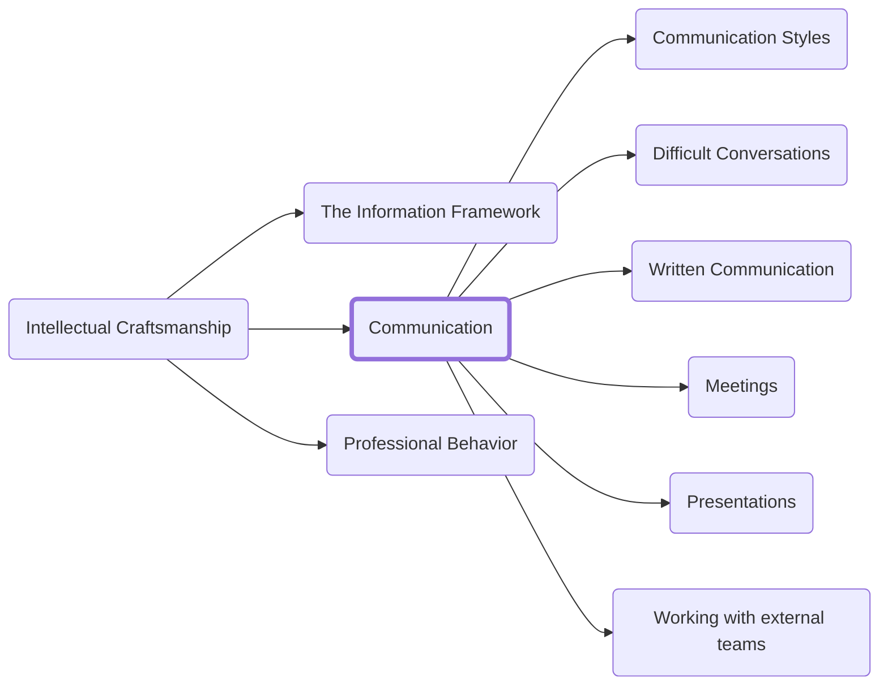

TODO: Write about the importance of communication here.

<h3>Navigation</h3>

```mermaid
graph LR;
  A(Intellectual Craftsmanship)-->I(The Information Framework)
  A-->B(Communication)
  B(Communication)-->C(Communication Styles)
  B-->D(Difficult Conversations)
  B-->E(Written Communication)
  B-->F(Meetings)
  B-->G(Presentations)
  B-->H(Working with external teams)
  A-->J(Professional Behavior)

  style B stroke-width:4px

  click A "{% post_url 2023-01-05-intro %}"
  click C "{% post_url 2023-01-05-communicationstyles %}"
  click D "{% post_url 2023-01-05-difficultconversations %}"
  click E "{% post_url 2023-01-05-writtencommunication %}"
  click F "{% post_url 2023-01-05-meetings %}"
  click G "{% post_url 2023-01-05-presentations %}"
  click H "{% post_url 2023-01-05-externalteams %}"
  click I "{% post_url 2023-01-05-info-framework %}"
  click J "{% post_url 2023-01-05-professionalbehavior %}"

  click A "{% post_url 2023-01-05-intro %}"
```