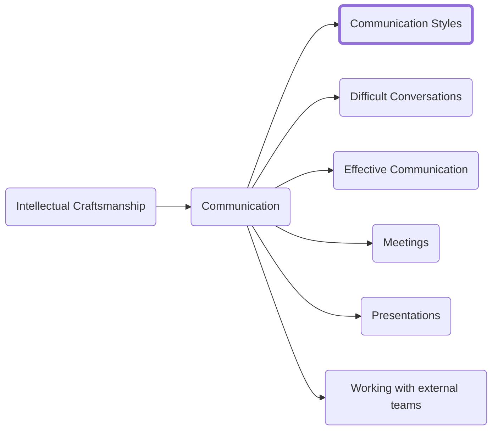

> "The single biggest problem in communication is the illusion that it has taken place."
> George Bernard Shaw

If you want to be successful you have to find ways to communicate with others that helps them understand. Communication is in many ways a one-sided equation. One party speaks and it is up to the other party to understand. Without that understanding the speakers is not communicating they are just saying words.

If you want to learn to communicate effectively then you need to find ways to express the ideas you have in a way that is tuned to work best for the person you are speaking to. You need to modify your presentation of an idea to make it something that will land clearly to the receiver of the message. That leads us to the Platinum Rule: "Do unto others as they would have you do unto them." To accomplish that we must:
1.	Understand our own communication style.
2.	Understand the communication style of the person we are talking to.
3.	Find ways to modify our style of communication so we are better understood.

Some people communicate in a direct or even short manor. You might get an email that says "I need the report by Friday". Others have an almost compulsory need to start from pleasantries. They could not imagine coming to your desk to ask you for something and not asking you about your weekend plans first. We need a tool to help decode the underlying communication styles and identify patterns so we can quickly recognize them and tailor our communication to the listener. Enter DISC. DISC is a tool for understanding the habits and patterns in our styles of communication. Unlike other "personality" tests DISC is not attempting to say you are always a particular way. Rather it provides a toolkit that can be used to better understand both your own natural communication tendencies and those of the people around you. When you understand your own tendencies and how you differ from those you interact with you can subtly modify your style to be on the same wavelength as someone else and communicate with them more effectively.

## The Styles
The first step is to learn to read the signs and determine what tendencies you have. We will discuss what each style looks like but to get an accurate read I recommend starting by doing a DISC assessment (the MT DISC tool at manager-tools.com is excellent) for yourself.

DISC is represented as a two-by-two matrix. It is divided vertically with the left-hand quadrants being 'task focused' and the right hand being 'people focused' and divided horizontally with the upper quadrants being 'outgoing' and the lower ones representing 'reserved'. Most people will have one primary quadrant and one secondary one. Those quadrants will always be neighbors because the tendencies of a high C and a high I are mutually exclusive.

### The High D
> "Winning isn't everything; It's the only thing"
> Vince Lombardi

People with High D tendencies are direct. They seek power and control. They sit on the cross streets of outgoing and task focused which means they are going to do whatever it takes to get the job done. They are no-nonsense and will take charge to make sure the work completes. The high D may come off as impatient but they will get be sure the project lands on time.

The high D is assertive, independent and competitive. They are focused on measurable results including their own track record. They are comfortable with change to a fault. They hate (and often even fear) stagnation, routine, and being taken advantage of and they will do everything they can to avoid those situations.

High Ds have a low tolerance for the shortcomings and feelings of those around them. They can be impatient and stubborn.

They have the ability to block out the world when working on a project. That heightened focus allows them to deep dive on complex topics without the risk of distraction.

In stressful situations they will often react by blowing up. They vent the anger and frustration especially when others around them do not possess their otherworldly ability to deep focus on a task. The High D chooses fight over flight every time they are challenged.

#### Identifying a High D
Look for the following behavioral traits:
- Competitive: They need to win
- Take charge: They are natural leaders who want control over how things are done
- No nonsense: They see no point in small talk and will try to cut through red tape
- Impatient: Results are king so anything getting in the way of them must be cut out ruthlessly
- Task focused: They will get the job done but will not always consider the impact it will have on others feelings
- Demanding: Results come before everything else so the high D has a high bar and will expect you to meet it. 

Observable behaviors to look out for:
- Speaks in a forceful tone
- Prefers verbal to written communication
- Makes steady eye contact
- Speaks rather than listening
- States rather than asking
- Speaks rapidly and at a high volume
- Impatient; may cut you off mid-sentence to get to a point

In email expect short sentences and not a lot of detail. They make brief, forceful, and to the point statements. They make heavy use of abbreviations (even to the point of abbreviating their own name or not signing off at all.) A high D will never read your attachments and is likely to get a long email and call you so you can 'give them the essence'. When sending mail to a high D put extra focus on getting to the point as quickly as possible.

### The High I
The high I is a social butterfly. They seek popularity and prestige. They are excited and energetic and tend to put relationships in front of the task at hand. They will naturally talk about themselves a lot. They pay attention to their social standing and will go to extremes to find ways to be accepted socially.

High Is approach problems with enthusiasm and energy. They are persuasive and great at selling you on a vision of the future. They effortlessly build coalitions to get things done and are natural 'idea' people.

They need regular social contact and have trouble with focus. They have a tendency to take small amounts of data and extrapolate them out assuming trends that may or may not exist. Why let data get in the way of a good story. They crave excitement and will look for the new cool thing at the first sight of stagnation in a project which often makes it difficult for the High I to finish something. They are too busy chasing the next squirrel.

#### Identifying the High I
Look for the following behavioral traits:
- Approval seeking: They thrive on acceptance and regular re-affirmation that everyone likes one another.
- Fast paced: They move and talk quickly. They are naturally full of energy and exuberance
- Optimistic: They will sell you on the dream and it is going to be a positive one
- Social: They would rather spend an afternoon getting to know someone new then drudging through data
- Spontaneous: They will often act impulsively.
- Enthusiastic: The high I brings a ton of excitement to this world. The trick is getting them to direct it at the right things since everything is exciting and nothing is more exciting then getting to interact with other people (even at the expense of the work.)
- Impulsive: They tend to act fast and not always consider the impact. Their enthusiasm cuts both ways and can lead them to take action before considering the impact

Observable behaviors to look out for:
- Tells stories
- Not afraid to state their opinion
- Dramatic delivery
- Lots of inflection in their voice and gesticulation with their arms
- Launches into informal speech
- Spontaneous action

In email expect lots of exuberance. Emoji were created for the High I to properly express their emotion. They overuse formatting like exclamation points, bolding, and highlighting. They will reference the personal as much as the professional. When a high I says "how was your weekend?" they genuinely want to know (and desperately hope you will ask them the same so they can tell you all about what they were up to.)

### The High S
The High S is stable and supportive. They seek sincerity and appreciation. They look for stability and security and 'risk' is a dirty word. They are measured in their approach to problems and do not like to change without clear justification that the existing systems aren't working. They focus on strong relationships built on a foundation of trust. They look for opportunities to help and cooperate with others. They are warm and approachable individually but often reserved around larger groups.

They have a tendency to avoid confrontation opting instead to give in. That tendency can often put them in situations where High Is and Ds take advantage of them. They tend not to speak up even when they know something is wrong because it might cause conflict. They do not handle change well and struggle when the status quo is no longer acceptable.

#### Identifying the High S
Look for the following behavioral traits:
- Helpful: They will go out of their way to find ways to help you out.
- Reserved: They often do not speak their mind especially if conflict is involved.
- Predictable: High S people are dependable and are more likely to follow routines. You know what to expect from them and their actions are generally pre-considered. 
- Slower paced: They tend to think and plan before taking action.
- Passive: They generally do not take strong stands and will not challange the status quo.
- Modest: They tend not to sell themselves but appreciate heartfelt appreciation.
- Passive: They generally do not like being in the spotlight. They disslike conflict and will generally back off of difficult conversations.

Observable behaviors to look out for:
- Slower rate of speech
- Ask more than state
- Reserve their opinions
- Lower volume
- Less forceful tone

High Ss tend to avoid email. It feels impersonal and they have a hard time making genuine connections over email. When they do send mail they include lots about the people (but not in as forceful a way as the high Is) They look for opportunities to connect and ask questions more than making hard statements.

### The High C
The high C lives for accurate, data driven results. They seek accuracy and precision. They thrive in a controlled environment where they have all of the data required to accurately answer the questions they have. More than the other behavioral styles the high C sees the world in black and white. If there is not a clear answer then we just have to gather enough information to find one. They can have a hard time understanding why others let their emotions get tied up in decision making.

The high C is a champion of accuracy and are organized and great at analyzing problems. They want to understand how things work so they can ensure that they are working optimally. In the extreme this comes in the form of 'analysis paralysis' where they are always hunting for the next useful piece of data that might help clarify some corner of a problem.

For the high C 'technically correct' is the best kind of correct. The need for perfection can manifest itself as a lack of understanding when others cannot meet the bar for correctness.

#### Identifying the High C
Look for the following behavioral traits:
- Precise: Accuracy reigns supreme.
- Logical: Arguments must follow proper logical structure. They need to understand the background and the 'why' for actions before taking them. They tend towards the hyper-analytical.
- Systematic: They are a stickler for details and will not leave a single stone unturned in their quest for knowlege and "correctness"
- Careful: They are methodical in their approach to everything producing detailed plans with large appendixes of data to back up their points.
- Restrained: They do not take action lightly and tend to only speak up in key moments. They generally do not show strong emotions in large groups saving them for one-on-one conversations with their inner circle. 
- Reserved: They do not naturally form lots of close relationships and can come off as cold.

Observable behaviors to look out for:
- More formal
- Their voices stay steady and unwavering
- Fact oriented. They will bring data to the conversation
- Slower conversational pace
- Prefer written over spoken communication

In email expect long, detailed missives that cover a wide range of topics. The high C loves email and cannot understand why all communication is not done through such a glorious medium. They send you detailed Excel sheets as attachments and form complex, multi-layered arguments in each mail they send.

## Improving your skills at identification
You should now have a good understanding of the basic styles that exist and I have provided some basic hallmarks to use when identifying what someone's style is. We can now deep dive to build a toolkit to rapidly identify the style of the people we interact with.
There are two main pivots to assess someone on:
1.	How Direct vs Indirect they are
2.	How Task vs People focused they are

We will assess these by reading the other person based on what they say (or do not say) and how they say it.

### Assessing directness
A direct person will create a powerful first impression. Coming on strong these people take initiative and are not afraid of risk. They speak truth to power if they think it will help accomplish the goal. They have a tendency to be impatient with others who are not able to keep pace with them. They look for quick opportunities to make rapid decisions. Correctness is just a suggestion; they will take full advantage of the 80/20 principal to get lots done quickly and leave the rest for someone else to pick up.

Direct people will get frustrated when things are not moving quickly or if topics have to be revisited. They will keep throwing out new ideas and plans. Quantity beats quality and they have the results to back it up.

They have strong body movements. Expect lots of gesticulation and pointing. They make strong statements with conviction. They speak quickly and do not wait for you to catch up.

On the other side of the coin the indirect person thinks before they speak. They tend to listen and ask questions more than they speak. They tend to couch strong statements saying things like "As far as I know" and "to my knowledge" before making a strong point. 

They tend to proceed with caution trying to avoid risk and identify safe ways to proceed. Unlike direct people they tend to take setbacks personally. They take the time to fact find and ensure the right decisions are being made.

Indirect people are often stoic not showing their emotions as often. They have a core set of close relationships where they will share their true thoughts but they hesitate to share what they are thinking with the group as a whole.

They are often more subdued in their body movements and speaking volume. The questions they ask are often nuanced and cutting because they have spent the time to really consider the options and think deeply before choosing to speak up.

### Assessing people vs task focus
The second key determining access in figuring out what behavior tendency someone has is how people focused they are. While directness indicates how they interact with the world supportiveness gives us a window into the motivations behind their actions.

People focused people speak with their bodies. They make strong eye contact and speak about the impact on feelings. They look for commonalities and opportunities for consensus as a way of building your bond. They tend to use stories as a way to make a more personal connection.

They prioritize the people in their lives first and the tasks second. They might not hit a deadline but it is because they were helping someone else land an important feature. They will often go out of their way to help others even when that means their own work suffers.

Task focused people are stoic and hard to read. You will often hear them described as "a great guy if you get to know him." They tend to keep some distance both physically and emotionally from those around them. You may not know exactly how they feel in a situation because they push for a focus on facts and the tasks being done and rarely let you get a full and accurate picture of their thoughts on a topic. They tend to be rigorous on deadlines and are more likely to respond to you asking for help with 'now is not a good time'.

## Modifying your behavior
They key to successfully communicating with people who are not the same behavioral style as you is to become build behavioral adaptability. You need to look for ways to modify your communication so that it lands with impact in the way that the recipient is best fit to receive.

Your first reaction might be to push back on the idea that you change your communication style to be more like someone else's. Is it not disingenuous to behave differently with different people? What I am suggesting is not that you change who you are fundamentally but rather you find commonality with other people. If you travel to another country, it is the right and respectful thing to follow their norms and customs. As with travel, when you communicate with someone following their communication norms and customs will go a long way towards avoiding being labeled a 'communication tourist'.

The goal is not to fundamentally change who you are or how you present yourself but rather to find strategic areas where you can relate to others experiences.

<h3>Navigation</h3>

