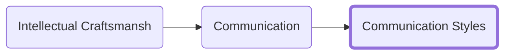

<h3>Navigation</h3>

```mermaid
graph LR;
  A(Intellectual Craftsmansh)-->B(Communication)-->C(Communication Styles)

  style C stroke-width:4px

  click A "{% post_url 2023-01-05-intro %}"
  click B "{% post_url 2023-01-05-communication %}"
```

|[Previous]()|[Next]()|