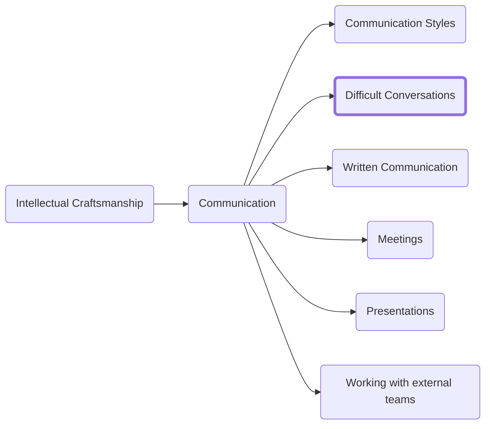

TODO: Edit content and instert here

<h3>Navigation</h3>

```mermaid
graph LR;
  A(Intellectual Craftsmanship)-->B(Communication)
  B(Communication)-->C(Communication Styles)
  B-->D(Difficult Conversations)
  B-->E(Written Communication)
  B-->F(Meetings)
  B-->G(Presentations)
  B-->H(Working with external teams)

  style D stroke-width:4px

  click A "{% post_url 2023-01-05-intro %}"
  click B "{% post_url 2023-01-05-communication %}"
  click C "{% post_url 2023-01-05-communicationstyles %}"
  click E "{% post_url 2023-01-05-writtencommunication %}"
  click F "{% post_url 2023-01-05-meetings %}"
  click G "{% post_url 2023-01-05-presentations %}"
  click H "{% post_url 2023-01-05-externalteams %}"
```