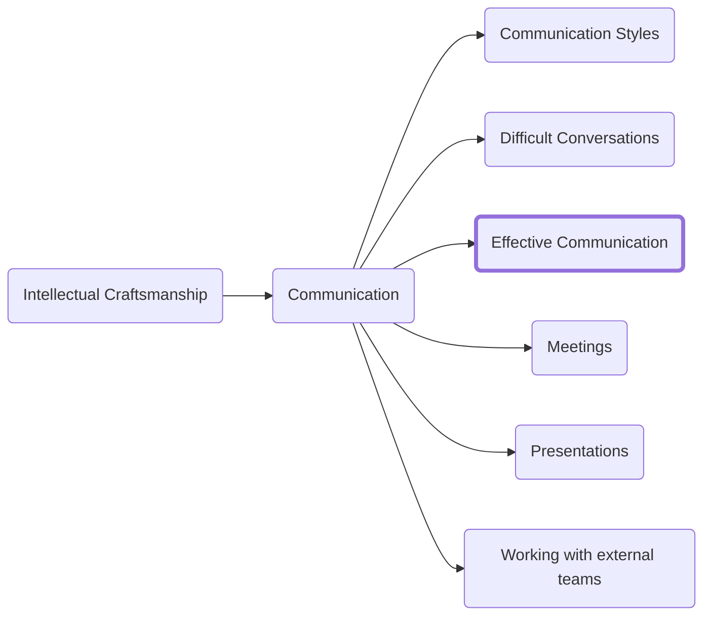

Once you have learned how different people communicate you need to hone your ability to speak and write in clear and expressive ways. In this section we will discuss three main ways that you can ensure what you write gets read, your arguments convince, and action is driven the way you intend.

We will cover:
- Techniques for communicating with clarity
- Ways to structure your ideas to keep the audience engaged and increase their understanding
- A method for ensuring your ideas land with impact

# Clarity
One of the most important skills to learn is how to communicate your ideas clearly and concisely. We will discuss several techniques for both making your intentions clear and for reducing the burden on the reader. If you want people to read your writing, then you need to put in the effort to make it readable.

### BLUF
BLUF is an acronym which stands for "Bottom Line Up Front." It is designed to enforce clarity and speed in writing.

A BLUF consists of either a call to action with a deadline or a single question with a limited set of options to pick from. Your goal is not to tell a story but to make it exceptionally easy for the reader to know what is required of them.

You may include additional context after a BLUF, but you must always state first what you require from the reader before you provide additional details.

Including a BLUF in your writing has two main benefits:
1.	The audience may take up the call to action or answer the question you have posed without requiring any additional context. If they do need the context, then you can still provide it later in the piece of writing. The purpose of professional writing is to drive action, not to be read. If the action was taken and it did not require additional time or effort, then the writing was successful.
2.	It primes the reader to understand what you are asking for. If you do not set the context up front, the reader will often have to reread once the question or call to action is made clear to understand. It is difficult to evaluate and understand what parts of a piece of writing are relevant until you have a lens with which to view the content. BLUF provides that lens.

### Reducing complexity
>I would have written a shorter letter, but I did not have the time.
>Blaze Pascal

Good writing requires ruthless editing. In particular focus on reducing the complexity of your writing as much as is possible without losing expressiveness or watering down your ideas.

The acceptable bar for complexity will be relative to what your audience knows. Consider who you are writing for and adjust the details to suit that audience. Be careful though, if you simplify complex topics too much you risk diluting the ideas in a misguided effort to make them universally applicable.

Complexity in writing exists at four levels:
1.	The overall size of the piece of writing
2.	The length of the paragraphs
3.	The complexity of the sentences in those paragraphs
4.	The complexity of the words in those sentences

Here are some strategies for reducing the complexity of your writing:
- Make sure that you are using the right tool to communicate your ideas. For instance, you must choose if an idea is best sent in an IM, email, document, etc. As the size increases, consider if a written medium is the right way to communicate your ideas.
- Avoid run-on paragraphs and paragraphs that cover multiple topics. You should be able to refer to the ideas in a paragraph by a single plural noun.
- Have a maximum of 3-4 sentences in a paragraph.
- Avoid long sentences that cover multiple points. Each sentence should be atomic, covering only a single topic.
- If you can, reduce the number of multi-syllable words. In some scenarios longer more descriptive words are necessary to communicate a point but try to avoid adding them unnecessarily.

### Removing bloat
All first drafts and most completed writing is bloated with excess. Your job as the author is to identify words that are not adding to the sentence and eliminate them.

There are three kinds of bloat you need to eliminate:

1. Words that do not add to the text
2. Filler phrases
3. Needlessly complex phrasing

#### Words that do not add to the text
This is the most common source of bloat. It is easy to add extra words to their sentences. Take "In my personal opinion we risk overdrafting the account." The word "personal" can be removed without impacting the sentence. Of course your opinion is personal. Moreover the whole phrase "In my personal opinion" can be eliminated without impacting the meaning of the sentence leaving us with the much more clear phrasing of "We risk overdrafting the account."

Similarly look for words that attempt to emphasize extremeness.

#### Filler phrases
Once you start looking at writing with an eye for bloat you will start to see common filler phrases that bloat sentences and situations where the sentence has been stretched.

Take "This isn't to say that every rectangle is a square." While not incorrect how much clearer would it be if it became "Not every rectangle is a square."?

Look for phrases that communicate how the author plans to explain an idea: "I might add" "It bears noticing", "It may be of interest". If it bears noticing then notice it.

#### Needlessly complex phrasing
Look out for long words that convey the same idea as shorter ones. Substitute "implement" with "do", 

Not every long word requires removal. In some cases there is a longer word that clearly describes a concept .

Take "penultimate". Yes you could say "the second to last" in it's place but if you believe your audience will know the word it is likely the clearest way to get the idea across.

# Structure
Structure is the best way to improve your writing. Improving prose to improve clarity happens only with time and practice but you can easily re-structure your ideas to improve the quality, impact, and clarity of your writing.

The order in which ideas a presented is the SINGLE MOST IMPORTANT FACTOR in clarity of a piece of writing. When presenting ideas, present a summarized version of them before running through each point.

The goal is to present ideas with enough clarity that even if someone disagrees with the conclusions, they should not be hung up on understanding the argument or the validity of the arguments being made.

### Writing a Compelling Introduction
For longer form writing like a whitepaper, you will want to include an introduction. I recommend the use of SCQ which stands for, Situation, Complication, Question and serves as an outline for the basic requirements of a good introduction.

The main point of business writing is to communicate to the reader something they do not know. You cannot begin with unknowns. Instead, I recommend you start from ideas that your intended audience is familiar with and pose a question they have either already considered or would be interested in considering if given the background.

#### Situation
In the "Situation" you set the stage. Nothing in the situation should be refutable. You want to start from a place of agreement and familiarity. All your ideas must be presented at the level of specificity necessary for your intended audience. In short, you want the depth of information provided to align with the expected level of understanding.

#### Complication
Once we bring the audience into alignment around the "Situation" we need to make it clear the purpose of the writing to follow. Professional writing is about resolving an issue. This is the problem you intend to provide a solution to in the remainder of the document.

#### Question
Now that the audience is primed with the problem you provide a question either explicitly or via implication. The remainder of the piece of writing should be providing an answer to that question.

If the question is "How?", you should provide a set of steps.

### Thinking in Trees
Humans can only keep track of a max of 5-7 ideas simultaneously. If you are attempting to teach someone a complex topic it’s best to look for ways to combine ideas into a set of categories that help people follow your thinking process.

As you guide people through the points start by summarizing what you are going to say and then providing the set of ideas that make up that summary. This is a form of the adage "Tell the audience what you’re going to say, say it; then tell them what you’ve said."

By providing a primer of what the reader should expect they should be able to consume the remaining ideas with that context in mind which allows a better understanding of both the ideas and the logic in your argument.

We can represent the structure of a piece of writing as a tree where at each level we provide a summary of the points below them. When you first start to structure your writing like this, I recommend actually drawing the tree out denoting what groupings you plan to have before you put pen to paper. This forces you to consider the appropriate structure and will often highlight cases where you need to remove a point or add one. Doing that work up front forces you to form a cogent argument before you have to put in the work to write (or edit if you are pulling from your reference system)

#### Rules for effective tree structure
- Ideas at any level of the tree must be summaries of the points below them
- No sub point should stand alone. If an idea is not a part of the group, then it should be folded into the parent.
- Ideas should always have a relationship downward to its children and horizontally with the other points on that level of the tree
- Never write about categories, only ideas. Use the structure of the document (both in idea organization and typesetting) to communicate the categorization of ideas
- Never answer a question for the reader before you have raised it.
- As you transition between ideas, reference ideas backwards. Rather than stating your intention to move forward (e.g., "The second idea is") reference backwards and then proceed (e.g., "The issues caused by the first idea are compounded by the second idea")

Highlight your logical structure with Meta-communication

Once you have written and grouped your ideas you have one additional step to highlight that structure and improve the experience of the person reading the document. This section will concern itself with the typographic layout of your ideas.

#### Rules for highlighting structure:
1.	Never use a single instance of an element (heading, subheading, bullet point etc.) Headings imply a grouping so must only be used for sets of related ideas. Titles are (of course) the one exception to this rule.
2.	Headings must be stripped down to their essence. They are there to serve as a visual anchor more than as part of the text.
3.	When possible, have headings use the same wording as the initial introduction above to make the structure easier to follow.

## Impact
As we discussed in the section on structure there is a limit to how many ideas someone can focus on simultaneously. To that end I suggest you use three points when making an inductive argument. Anymore, and you risk overwhelming your audience or diluting the quality of your ideas. Any less, and the ideas feel disconnected or unsupported.

There are three main reasons why I recommend you leverage this rule:
1.	Your argument will be memorable
2.	You will be forced to pick just your three best ideas
3.	You sound more structured and confident in your speaking and writing

People will remember your argument both because it is rare for someone to have more than one reason for what action to take but also because they can forget even two of the supporting reasons and still have one driving their decision making.

By limiting the number of arguments, you avoid losing your audience. The gauntlet acts as a reducing valve for focusing your ideas and presenting just those with the most impact.
Your arguments feel polished, and you will come off as confident because it implies that you have done a non-trivial amount of thinking before presenting your ideas.

<h3>Navigation</h3>

