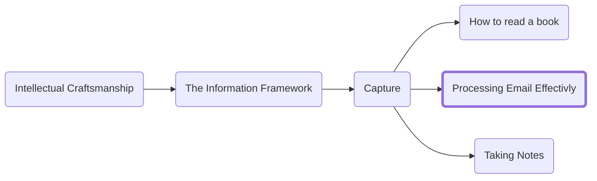

Knowing how to write a good email is an essential professional skill but email is also a dangerous double-edged sword. For most people, email is less of a tool as much as a near infinite source of distraction. This document provides a framework for interacting with mail that will increase its utility and reduce the pain associated with it. I will discuss when email is the correct method of communication, how to process email to extract value without missing vital information, and finally I will share some Outlook specific configurations and rules that will make your email experience smoother.

## What you need to know about email
- There is an expectation that the majority (if not all) mails are responded to by the end of the day at the latest (more on which mails you are expected to respond to below.) If more time is needed to complete the request/ask, then at minimum you should respond acknowledging receipt of the mail and provide a timeline of when you expect to be able to provide an update.
- Email is not a real-time method of communication. Unlike in-person conversations or even instant messages, there is no reasonable expectation that you will respond quickly. End of day is sufficient. You may have some people in your work life who insist that mail should be read and actioned in minutes. Do not let their misunderstanding of the medium guide your behavior.
- If you or a mail distribution list you oversee like a team or on call alias are not in the To line of a mail, there is no expectation that you will respond. You may respond when on the CC but if you find yourself always responding off the CC then consider reducing the frequency that you do so.
- Remember that communication is what the listener does. To that end you need to ensure that the information you provide or question you pose is best done via mail or you are posing an undue imposition to the receiver. To that end:
    - You should assume attachments to mail will not be read unless you state a clear call to action with a deadline for when review must take place (ideally tied to a meeting where the attachment will be discussed). Some will read them, but most people will not make the time. I recommend using attachments sparingly because of the burden they place on the recipient.
    - Email is not the place for a white paper. If you need to communicate big ideas or share enormous amounts of data, then email is not the correct medium and you are imposing on others in asking for them to review information communicated in the wrong form. Use meetings, presentations etc. to communicate complex ideas as those mediums are better suited to nuance and follow up questions.

## Rules for effective Inbox management
Beyond knowing when and how to write a good mail we must discuss how to manage your inbox. Because Microsoft is traditionally a very mail focused company there is a strong need to have a defined system for processing mail in a way that reduces missed mail and does not take over your life.

### Process Infrequently
Mail is not a real-time communication method (with the one exemption being on call rotations where mail is a useful tool for monitoring incoming incidents and asks made to the team). 

I suggest processing mail (more on checking vs processing later) three times daily:
- Mid-morning: If you are a morning person, I recommend using the energy you have (and the quiet of the morning) to knock a thing or two off your To Do list before checking mail but you can do it first thing if that is helpful for prioritization's sake.
- Mid-afternoon: If done right, mail processing becomes easy with practice. I recommend you put it into your post lunch/mid-afternoon slot when you have a dip in energy.
- Evening: If you feel itchy not looking at mail often, add a final round of processing either right before leaving for the day or sometime mid evening.

### Limit when your mail client pulls mail from exchange
When you are not processing your mail, set your mail client not to pull new emails from exchange. 
This is essential. It is far too easy to get distracted by incoming mail so you must disable all ability for new mail to come in. If you are needed urgently, someone will find other methods to contact you.

Once you have decided what times are best for you to process mail, schedule them on your calendar to ensure you have dedicated time to do it. This is especially important because you no longer process them throughout the day. I recommend 15 minutes to start with until you get more practiced at the process.

### Process do not check
I specifically chose the term "processing" over "checking" because the way I suggest you approach mail is not passive. By the end of this process, you should have handled most if not all the mail in your inbox and have zero "debt" remaining.

> A note on email debt: If you currently have hundreds or thousands of emails in your inbox archive everything older than 1 week ago and then follow the steps I will outline below. Anything more than a week old was not going to be responded to anyways and anything important will get bumped if necessary or the authors will find another way to connect with you. You can always fetch things from your archive, as necessary.

### Touch only once
When processing mail you should never touch a mail more than once. Every time you revisit a mail you must repeat the effort of understanding the context. Do not squander that effort.

As you read an email look for the following actions. This list is intentionally ordered in the suggested
1.	__Delete the mail__: If the mail has no relevance to you (e.g., an alert when you are not on call) then send it to the round file.
2.	__Archive the mail__: If there is no action for you (or anyone else) in the mail but it has information that may prove valuable, then archive it.
3.	__Delegate the action__: If there is someone else who is a better fit to meet the ask then add them to the thread and gracefully make your exit.
4.	__Respond to the mail__: If the mail can be responded to in less than five minutes then respond to it before moving on to the next mail.
5.	__Move it to a task management system__: We will discuss task management in a later chapter but for now, add a task to whatever system you have including the name of the thread (so you can find it when you have done the necessary homework to respond to the mail.) Archive the mail.

### Set boundaries
As you process you need to set a minimum number of mail that you will leave in your inbox every day. Personally, I make it to zero emails in my inbox daily, but I understand for some that may not be possible, so at minimum, ensure you do not have enough mails for outlook to show a scroll bar. If you follow the guidance in this document email processing should take minutes not hours so there is no reason not to hit a limited target of emails in your inbox daily.

## Writing actionable mail
The purpose of professional writing is to drive action, not to be read. To that end, you need to be thoughtful in how you communicate your ideas to your intended audience. In a perfect world an email requires a max of a single response either answering the question you have posed or answering your call to action as appropriate.

### Decide what result you want
The first step in writing any mail is to determine what you want to accomplish. Every meaningful mail must have a specific call to action or a question you need the answer to. Deciding what your goals are up front before writing the mail will help you clearly get that result across.

### Use better subjects
Subjects are too often treated as perfunctory information. This could not be further from the truth. The subject is one of the most important parts of a mail as it is the best way to get a mail read and to increase comprehension of the mail. When choosing a title focus on something that communicates intent not just a topic. Note that the "Please" in each of these examples is used to indicate that there is a call to action of some kind and the mail is more than just an archive of information.

| Instead of using this subject | Use                                                    |
| ------------------------------| -------------------------------------------------------|
| Performance Reviews           | Please complete performance reviews by 11/15           |
| Incident A                    | Please review post incident review work from Incident A|

### Consider your audience
To maximize the chance your email is read and understood you need to consider who you are speaking with. Once you have identified who to speak to, you should consider tailoring your writing/communication style based on what information they may already have and what kind of communication style they prefer. For the latter look at past mails they have sent to identify patterns. Are they short and to the point? Formal? Full of emoji? To the extent you can without feeling gimmicky, adopt a style the reader will feel at home with

<h3>Navigation</h3>

