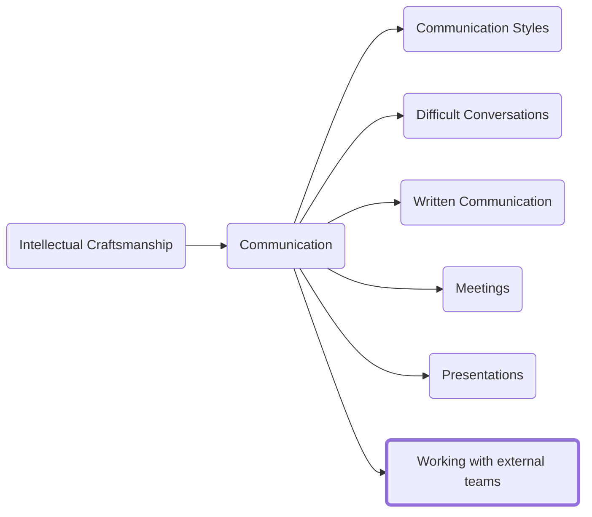

One of the challenges of working in a large company is locating someone who can help with an issue or provide the information or data you need. This section will talk about strategies for locating the write people to help and techniques for reaching out in a way that will get them to respond.

# Reconnaissance
The first step in connecting with an external team is to locate the right people to reach out to. You generally have two paths to take. You can attempt to locate someone through your professional network or you can do the digging yourself

## Your Network
The approach most likely to lead to success is to locate someone in your personal network who may have a contact that you know or even someone who is more likely to know than you are. One of the primary difficulties with being new to an organization is that you have not had sufficient time to build a network so if you do not have good contact first confirm with your team that they do not have pointers.

If you find a good contact through a mutual acquaintance, it is common practice to have that acquaintance make the introduction on your behalf. Once they introduce, they should be thanked and dropped to the BCC in the next mail as they have done their part unless the rest of the conversation is of relevance to them.

## Open-Source Intelligence
If you have failed to locate a good contact (either a limited team alias or a specific person) through your network, you will need to research to attempt to find a good contact. While this is not the easiest process to describe some useful options would be
- Internal SharePoint sites
- Wikis
- Documents on shared drives
- Your email inbox (less useful for people new to an organization)

## The Ask
Once you have located a potential contact or distribution list to send mail to that might have some information for you it is time to reach out to them with a request. This section will outline some rules to follow to increase the likelihood of a response.

### Guidelines
- When making an ask of someone outside the team you are imposing on the recipient. It is your responsibility to write the request in a way that as much as possible reduces the impact of that imposition. This means you need to consider the structure and clarity of your writing. You must edit your writing to ensure it is only providing details that are relevant to the recipient.
- Timing matters. Mails sent on a Friday afternoon are much less likely to be read and actioned than those sent on a Monday. Similarly consider the time zone of the recipient.
- Email is an asynchronous form of communication; you should not expect a response any sooner than 24 hours.
- If you push too hard on an external partner outside of an already established relationship with clear SLA expectations like on call scenarios, you not only will not get what you want but it will be harder for you and your team to work with that partner in the future.
- I recommend avoiding sending mails to a large alias. If there are more than ~40 people on an alias most will have mail filtered to another folder and you are extremely unlikely to get a response. If a large team alias is the best option, you can locate in OSINT consider extracting a few M1 (frontline managers) from the alias and mailing them directly. 
### Writing the Ask
- Start with your ask. Before anything else use the subject of the email and the first one or two sentences to make the request. The easiest way to grab someone’s attention who might be able to help you is to put the request first.
    - Examples:
        - Subject: "Help with budget issue" - ❌
 	    - Subject: "Please help resolve $5k budget issue" - ✅
- Provide the right amount of context: You need to have done enough homework to provide the context necessary for the ask but you also want to avoid providing an avalanche of data or information. The most common mistake I see is providing the context of why you need something from them before even telling them what you are asking for. Often the context of why you need it is mostly irrelevant to the recipient.
- Ask for redirection: Often the first person you find/reach out to is not the right person to answer your question, but they may have good contact(s) that could help you. Asking politely for help locating the right person will often net you reliable results.
- Say thank you: Part of the process of working with external teams is trying to build a relationship with someone to get their help on a problem. As stated above this is an imposition to them so at minimum make sure to make it clear that you appreciate their help.

# How to interpret responses
_It is a reasonable request, but we will need some time to cost the work and determine when we can do it._ 
This should be read as a "Yes." They have indicated they think the ask makes sense but need to determine the size of the work and prioritize.

_We do not have the resources to support this ask currently._
They don't dissagree with the ask but it's not a high prority item for them. If the ask is urgent or a major blocker for you, then you must work within your team to determine if it is more appropriate to escalate and push for the work to be fit in or to identify ways our team can fund work on another system.

_Something that indicates they do not fully understand the ask_
If it is a minor misunderstanding, then clarify on the mail thread. If it is a more complex topic, then set up some time to discuss it with them further.

# What to do when you get no response
One of the most difficult and frustrating responses is to get no response at all. This can be a sign of several scenarios.

## You have not located anyone close to the problem
If you send mail to a distribution list (see the note on large aliases above) or reach out to a contact that has only a tangential relationship to the thing you are seeking, you may not get any response at all.
1.	If the net was cast too wide: Narrow your ask to a specific set of people. When sending mail to a distribution list it is easy for everyone on the list to assume someone else will respond. Asking specific people might not give you an answer but it is much more likely that you will get a response that points you to a person who can help.
2.	If the request was too targeted and you are not confident, they are the right person to ask: Go back to the OSINT section above and look for better contacts.

## You have the right person, but they have not responded
In some instances, you have been connected via a mutual contact or other trusted source and still are not getting a good response. In cases where you can be confident you have reached the right person but are failing to get a response you will need to escalate.

> Note that following this process more quickly than the timeline suggested below will end up making it less likely that you are able to get help. Skipping steps (such as jumping right to manager escalation will also increase the likelihood someone sees your ask as nuisance and is reticent to respond.

I recommended you wait at least 24 hours between escalations:
- If your first mail has seen no response in the first 24 hours, then ping the mail asking for help
- If you still see no response 24 hours later (and it is a person not a DL) then reach out to them directly via instant messenger
- If you do not get a response there, schedule a meeting with them for at least one day out
- If you do not get an accept by the day before then it is acceptable to add your boss to the email thread.

As a rule, plan to escalate three times over at least two different mediums (email, instant messenger, a meeting) before escalating with either your manager or their manager with the preference being to add your own manager first as a less aggressive method.

<h3>Navigation</h3>

