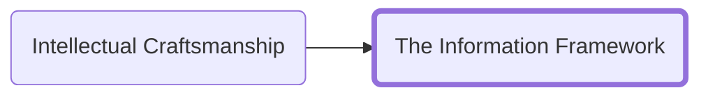
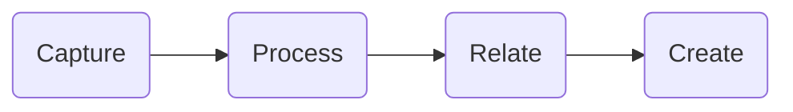

<h3>Navigation</h3>

While the goal of this site is to focus on action, we will start with some underlying theory that will help contextualize the goals behind the systems I will suggest you use. One of the hallmarks of a professional is the ability to process the information coming to them and extract what is useful and discard the rest.
Every day you come across information from hundreds of sources. Social media, books, in person conversations, videos and more provide ample inputs to provide you key insights.
That valuable information often comes not as a simple idea but intermingled within a larger context. It can be extremely difficult to identify what is going to be useful in the future and even harder to keep track of those ideas in a way that you can revisit them when they are relevant.
The information framework I am going to lay out formalizes a structured way of approaching incoming information that not only allows you to capture the ideas that are valuable but to place them in a larger context-free thinking environment to build insight out of the relationship between the ideas.

The framework is broken into four steps:

 
First, we __Capture__ ideas. We will cover how to gather information from various sources. Concrete implementations of this that we will cover are how to read a book with an eye for capture and how to take notes in meetings and at conferences.

When we __Process__ information, we extract the ideas from their context to expand their applicability. I will discuss a method for storing them in a way that allows them to be easily located when they are needed.

Once we have produced atomic concept-oriented notes on a topic we can __Relate__ the ideas together to find insight and cement our understanding of the ideas.

The interrelated information allows us to quickly recall ideas in new contexts and to __Create__ new things using the insights and writing we have already done. You will be able to quickly produce polished outputs from the effort you have taken to internalize and understand the concepts in the first place rather than always starting from a blank page.

|[Previous]()|[Next]()|