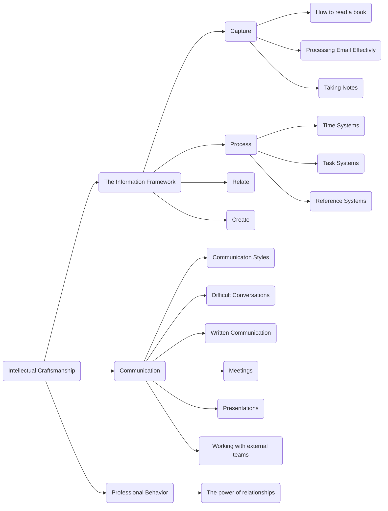

Welcome! This site is dedicated to giving you actionable recommondations for ways to succeed as a knowlege worker. The core of the site is a writing project I've titled 'Intellectual Craftsmanship'.

The modern workforce is increasingly focused on 'knowlege work' (a wonderful term coined by Peter Drucker.) The dicipline is in many ways a fairly new one. Technological innovation has rapidly increased the pace and scale that any one person is expected to handle but the tools and techniques taught to people starting out their career have not kept pace. I use the world 'Craftsmanship' to indicate how I think about the process. A good craftsman has built up a set of valuable tools and techniques for creating something from nothing. Similarly the knowlege worker is asked to take their core dicipline (whether that be engineering, finance, programming, etc) and turn that raw skill into something useful. It's this last step that I see lacking the most. Higher education will teach you the raw skill but it does not focus on the practical techniques that let you leverage that skill effectivly.

I want to help you build your toolkit and teach you the concrete techiniques that will help you get distraction out of the way and apply your core dicipline to create something great.

## Why I wrote this
Repeatedly I have seen people new in their careers join the corporate world and struggle to get a foothold. Too often this happens because no one is providing concrete and actionable tools to help people succeed. Most people are left to sort out the right and wrong ways of doing things on their own, relying only on sparse feedback to adjust how they approach problems.

While the skills learned in an academic setting do translate there are major differences especially when transitioning from mostly individual work to working with a team.
The major reason people are not given more help by their more experienced coworkers is that people worry that if they give advice, it will not work in every scenario. You will find that to be the case in this book as well. My goal in writing this book is to provide an answer not the answer. Once you have learned and internalized these rules you can build on them and hone them to fit your personal style of work and the circumstances you find yourself in but in the meantime, you will have concrete action to take.

I have broken the guidance into three major catagories. We will focus first on personal productivity. I will outline a set of tools for dealing with information. One of the main hallmarks of a professional is to be able to deal with large volumes of incoming information and deftly turn it into the right action. We will talk about the theoretical parts of a good information management process and then go deep on specific implementations to help you deal with the massive amount of data, tasks, and information you come across every day in your corporate life.

After breaking down the core systems of personal productivity we will turn our attention to some core behaviors I believe to be essential to being a good and ethical professional. This guidance is designed to multiply the impact you can have as an individual and make your work life more enjoyable.

Finally, we will talk about the cornerstone of a successful career: Communication. Learning to communicate with others with clarity and in a way that they can understand is one of the largest boosts you can give to a career.

This is the advice I give my friends and I hope it can be as helpful to you as it has been to me.

## Working with the garage door open
You will find that not everything I put on this site will feel "complete" and even those topics that are well flushed out may change over time. This is at least in part by design. One of the larger impediments to action in the workplace is imposter syndrome. When people only share the streamlined, polished or complete work they do with the world it is easy to look at what everyone else does and assume you aren't capable of doing what they do. I want to share not only the ideas but the process as well and that means that at time you will have the seeds of an idea or some problem statement I am working through but not get a fully polished version. At some point I may consider this project "done" but I suspect it will continue to evolve with me (or at least I hope it does.)

## If you don't like reading online
I put this content on a site for three reasons:

1. I wanted to have a free place that anyone with interest could come to to learn this content
2. I wanted to have a way to keep a living version of this project where I can add and adjust as I learn more
3. The searchability and hyperlinked nature of the ideas allows for more expressive interaction with the content

I also recognize that not everyone enjoys reading on the web (myself included) so I will also be making a snapshoted version of this content available both as an ebook and as print-on-demand in the near future.

## Resources
This project (like any good one I'd argue) stands on the shoulders of giants. I wouldn't have built these systems without the impact of other authors.

Writing this site required a ton of distillation of those ideas I've come accross. I've attempted to extract the essense without loosing the core idea but naturally there is still tone to be explored on each topic. To provide you good jumpng off points I've compiled a list of some of the most useful books and resources I know of to help you dive deep into the topics we have covered here.

- __The Effective Executive – Peter Drucker_ If you read just one business book in your life it should be this o
- ne. I read it at least once a year and every time I get something new and valuable from it.
- _The Manager Tools and Career Tools podcasts_ These are immensely valuable and cover every topic you could want in a professional setting. They know everything I do and a whole lot more.
- _The Pyramid Principle – Barbra Minto_ THE book on improving your writing. She sells it new on her website. It is not cheap so if cost is an issue, then used copies can be found. 
- _Getting Things Done – David Allen_ The bible of productivity. Allen’s work has been fundamental to my ability to manage my time and I am forever grateful for it.
- _Effective Presentation – Ros Jay & Anthony Jay_ A great overview of the fundamentals of presenting.
- _People Smart – Tony Alessandra Ph. D., and Michael J. O’Connor Ph.D._ A deep dive on DISC.
- _How to Read a Book – Mortimer J Adler_ As the title implies it is an in-depth guide to reading to gain a deep understanding and read more critically.
- Good Strategy Bad Strategy: The Difference and Why It Matters – Richard Rumelt. This is everything you will ever need to know about strategy.
- _The Go Giver: A Little Story about a Powerful Business Idea – Bob Burg and John David Mann_ A quick narrative read that talks about the power of giving.
- _Love is the Killer App: How to Win Business and Influence Friends – Tim Sanders_ A quirky read but does an excellent job of talking about the value of giving and building a strong network of friends.
- _How to Take Smart Notes - Sönke Ahrens_ A primer on the power of Zettelkasten.
- _Andy Matushak - Evergreen Notes (https://notes.andymatuschak.org/Evergreen_notes)_ The best example of a reference system.
- _Building a Second Brain – Tiago Forte_ A similar approach to Zettelkasten with some good examples and deatails on the benefits of such a system.
- _The Coaching Habit - Michael Bungay Stanier_ A quick little book about the power of asking good questions.
- _Crucial Conversations_
- _First Break All the Rules_

## How to navigate the site
This site is designed around a tree strucuture (something I strongly recommend when talking about clear and effective communication). Each page will highlight where it lives in the tree to help you understand where you are conceptually.

Here is the full page tree. Each page gives you the path from this introduction to that leaf. The charts are all linked to allow you to quickly navigate from this introduction to whatever topic you are interested in although generally I recommend at least reading the pages that come before reaching a given topic in the tree to help you contextulize the content.

