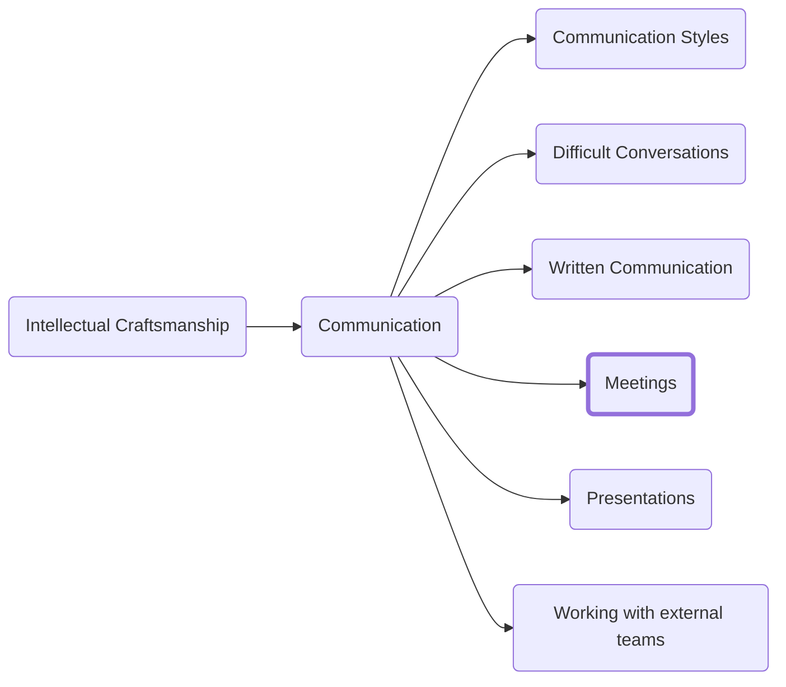

Most professionals spend their time bemoaning the time they spend in meetings. Anyone who has spent time in a cooperate environment knows that your calendar quickly swells with meetings that seem to accomplish little and take much.

You will often hear cries of 'This meeting could have been an email.' (Especially from our High C friends.) What I hope to provide in this chapter is a way of thinking about and running meetings that takes away that pain or at least majorly mitigates it.

The reality is that not every meeting will be run in this fashion but if you run your meetings this way people will notice

Meetings have one goal and one goal only: To drive action. If you attend (or run) a meeting and no action is taken during or as a result of the meeting, then that meeting has failed. Decision(s) should be made, plans adjusted or some other clear indication that the time spent in the meeting was for a purpose.

## Effective meetings run on schedule
The number one complaint I hear about meetings is that they don't stick to their times. How often do meetings run over by five minutes? What about 30?  As we discussed in the section on calendaring, your time is a way of voting for your priorities, so any extra time given past the allotted time is shifting the priorities of everyone in the room.

As an attendee you have limited control over this aspect. The best options you have are:
1.	Ask ahead of time for a defined agenda.
2.	Ask that topics outside of the agenda (or at least outside the initial scope of the meeting if no agenda is provided) be aggressively placed in a 'parking lot' to either be addressed at the end of the meeting if time remains or to be addressed in another meeting scheduled later if more time is necessary.
3.	Arrive and depart meetings at the pre-agreed upon times. When one person leaves it often prompts others to see the value in breaking for other things as well.
As the owner of a meeting, you have many more tools to make your meetings effective and efficient. The first of those tools is a published agenda.

## An agenda sets the tone
Having a published agenda is fairly uncommon beyond quarterly all hands meetings but it is one of your strongest tools to running an effective meeting.

The agenda serves three main purposes:
1.	It defines clear objectives
2.	It defines a strict timeline for resolving those points
3.	It gives you control over what is discussed in a particular meeting

### Defining clear objectives
You very likely join meetings every day with very little information about the goals or what's going to be discussed. Without guidance you are not provided with time to gather any information you need, form opinions, and even know if a meeting is relevant to you.

As someone running a meeting you should have already put in the work to determine what outcomes you want from the session. If defining an agenda is difficult it is a good sign that you have not done sufficient preparation for the meeting. As the organizer of a meeting and as a professional it is your responsibility to ensure that you use the time of the attendees as effectively as possible so make sure you have done the preparatory work ahead of time to define the outcomes you are looking for.

There are some cases where it becomes clear that diversion from the initial objectives is the right course of action. In most cases a diversion should be handled via a parking lot or by spinning out another meeting to handle that other topic but if you find the fundamental objective you initially had in mind has changed or is no longer relevant then you may need to pivot. This is the exception not the rule.

### Defining a timeline
Parkinson's Law is an adage that says, “Work expands so as to fill the time available for its completion.”

While this law is often used to describe inefficiencies and bureaucracy you can also leverage that idea. By pre-defining timelines for how long you will stay on a topic people will naturally attempt to be concise in their approach. The more meetings you run that stick to their agendas the more likely people are to respect them because it will be clear that no more time will be afforded to them if the topic cannot be covered in the time provided.

### Control over the discussion
One of the privileges that comes with running a meeting is the ability to define the outcomes and goals. If treated with respect and not abused a well-constructed agenda can be a great tool to ensure that your core objectives are met and that meetings do not spin off to cover a wide range of topics that are not of value to your core responsibilities.

## Preparation, preparation, preparation
Before you set foot in a conference room (or video call) you need to start meetings by defining your objectives and doing the work required to ensure that you can meet them. This applies both to meetings you are running and those you are attending.

## The What and the When

One of the biggest issues with 'meeting culture' is the steady creep of standing meetings. It feels as inevitable as the slow march of entropy that meetings that started with clear and focused outcomes devolve into rote status meetings or even worse meetings where everyone joins to decide that a meeting was not needed this week.

To help you avoid this hell I suggest implementing three rules:
1.	For any standing meeting, the agenda should include a point of order to decide if the meeting series should continue at some semi-regular frequency (for daily meetings I'd start with once a month, for weekly meetings once every two months, and for monthly ones once a quarter).
2.	If a meeting's only purpose is reporting of status, then kill the series and find better tools for tracking project status
3.	Meetings should include the minimum number of participants required to achieve its outcomes.
There are two exceptions to this rule:
1.	 Meetings that are legally required by some regulation. 
2.	Meetings with a team to either:
    1.	Recognize a milestone (which are almost by definition not tied to a particular cadence)
    2.	Meetings to reflect on team process (I like a bi-weekly cadence to allow time for novel issues to arise that need addressing.)

In the first case you are required to do so and there is no escaping it. The second case is the meetings where team culture and comradery are built.

Eliminating the bulk of a team's standing meetings does require the team to be more proactive in asking for help and requires the more senior members of the team to proactively identify opportunities to assist others but neither skill should require a litany of forces standing meetings to accomplish.

If the more senior members of the team are not making time to assist and grow the more junior members that is a performance issue and solving that lack of performance through mandatory meetings is like trying to drive a nail with the handle of the hammer.

<h3>Navigation</h3>

