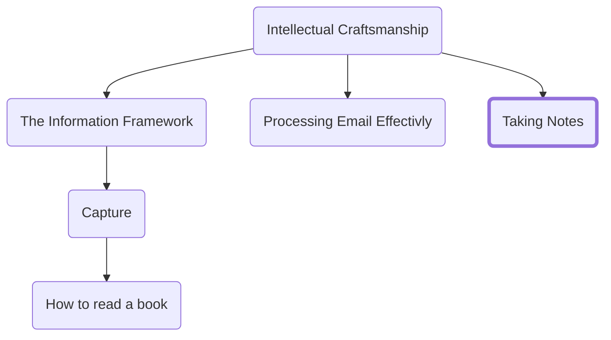

As a professional it is inevitable that you spend a non-insignificant part of your day in meetings. Learning to take good notes is the most impactful way to ensure that your time in those meetings is not wasted. It’s easy to write too much, write too little, write down the wrong things or just generally miss the mark.

In many ways notetaking is the purest expression of the skill of capture because you are forced to extract information in real-time. The average conversational speaking pace is 150 words per minute. The average handwriting speed is 25. You cannot capture everything that is being said, especially if you want to participate in the meeting.

As a note taker you have three goals:
1.	To capture key information
2.	To be able to use that captured information to remember what happened
3.	To be able to leverage that information to take action

To help you learn how to capture the essential details in a clear and expressive way I will cover the following five principals:
1.	Take notes by hand
2.	Write what was said not what you thought about it
3.	Hunt for action
4.	Develop your shorthand
5.	Use diagrams

## Take notes by hand
I’m all for technology but in this instance, I strongly believe there is no substitute for pen and paper. There are three reasons I suggest ditching the laptop:
1.	Typed, linear text is less expressive than handwritten. Even if you type staggeringly fast you will not be able to capture everything and there are a lot of ideas and concepts that can’t be expressed quickly enough from a keyboard (see the point on diagrams below) 
2.	Even if you have perfect willpower and zero distractions others in the meeting will assume you are checking mail whether you like it or not.
3.	Technology use in meetings disengages you. Whether you like it or not you are much more likely to be distracted by a rogue email or IM that will take you out of the meeting you are in. Meetings only exist because of the combination of the people in the room and if you are not there mentally then it is no better than not being there in the first place.

You may feel your handwriting is not clean enough to take notes by hand. If you can read your own handwriting, then it is more than sufficient to use. You are not sharing these notes with anyone else. If you are unable to read your own writing, then take the time to practice it. It is a skill worth having and can be done by anyone (of course barring physical disabilities) with some practice.

## Write what was said not what you thought about it
As you start taking notes it’s extremely tempting to capture your thoughts as you go. For instance, maybe you disagree with a point that was just made and want to write down all the reasons they are wrong. Do not fall for this trap. The goal of meeting notes is to capture what was said and what actions came out of it. Your notes should allow you to remember enough of the context that you can re-create the thought later if needed. If you have a sudden once-in-a-million lightning strike idea hit, you in a meeting then sure jot something in the margins but as a rule meeting notes are about capturing the context not your reaction to it.

## Hunt for action
Good meetings exist to drive action. If you don’t get action out of the majority of your meetings, then you are just socializing with fancy titles.
One of the most important things you can capture in a meeting is:
- What action is being taken?
- Who’s taking the action?
- When are they going to take that action?

As you take notes make sure you capture any instances where someone volunteers for an action (or is volun-told to do something.) Ensure that everyone comes out of the meeting with a shared understanding of the previous three questions for any action being taken. 

## Develop a shorthand
We’ve already discussed that one of the main issues with taking notes is the discrepancy between the speed of speaking and writing. Additionally, there are some parts of your notes you likely want to highlight in some way. To address both I suggest developing some basic shorthand to augment the notes you are taking.

Examples:
- Use initials in a circle to represent a person.
- Put a box around actions that you own
- Underline ending with initials for actions taken by someone else

## Use diagrams
Diagrams allow you to rapidly express complex ideas. You can quickly express the relationships between ideas and capture more nuance using pictures than you can with text. One of the main benefits of handwriting your notes is how quickly you can capture ideas with drawings, arrows, and symbols.

<h3>Navigation</h3>

