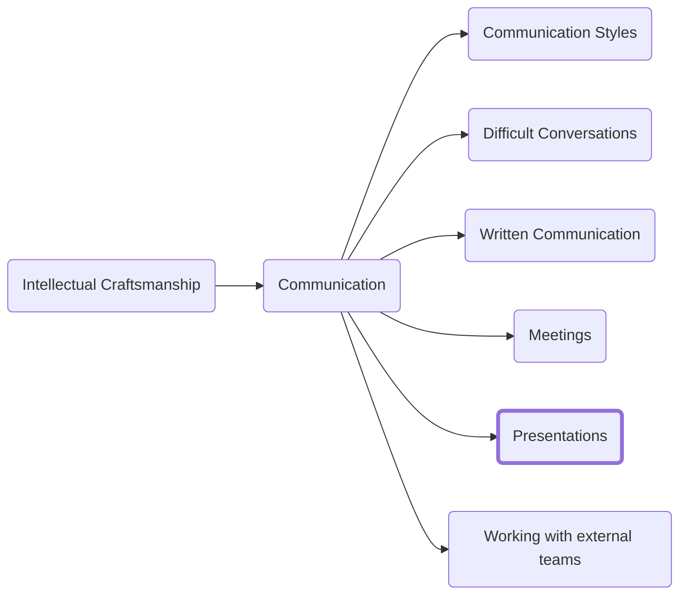

Presentations are a specialized form of meeting so start by applying all the other guidance about meetings to them. Presentations have one of two intended outcomes (or some blend of the two)

1.	To educate the audience on a topic
2.	To persuade the audience to come to a decision

We will discuss how to define the objective you want, write a speech that achieves that objective in a compelling way, and finally a method for ensuring your presentation lands with impact.

# Define outcomes
Before you do anything, you must consider what you want to achieve and decide what big question or call to action you want your audience to get out of the presentation. This will be an iterative process. Specificity is your friend in this endeavor. Rather than ‘Sell our new product’ instead opting for ‘Convince our biggest customer that our new product will reduce their supply chain costs by 30%.'

Continue to refine your objective until you can capture what you hope to accomplish in one specific sentence.

If you have been signed-up to do a presentation by someone else, make sure to ask them enough questions about their goals as well. Ask questions like ‘What would your ideal outcome look like?’, ‘What can you tell me about the marketing departments role in this?’

# Preparation
Once you determine the objective you need to assess who your audience will be, and what they already know so that you can write a compelling speech that avoids going over the audience’s heads without talking down to them.

## Find your audience

Once you have assessed your audience re-work your outcome again with the additional context of a more detailed look at who you will be speaking to.

## Crafting your speech

Once you have defined the outcome you want you need to craft a story to help bring your audience to that outcome. That story might be walking an audience through the complexities of a problem space and how a new system was designed to account for them. The key is that you are not just presenting data, you are producing one way of looking at that data and you need to consider the narrative that you plan to tell.

To ensure that you have a clear and consistent presentation I recommend you write your speech and memorize it. This suggestion often raises question because it sounds like the speech will be forced or otherwise rote in nature and there’s good reason for this concern.

The reality is that written English is not the same as spoken English and you will need to adjust your writing to be more like speaking. The first step is to follow the tenants we covered in the section on written communication. What applies to clear writing applies doubly so to speech. In writing you can get away with burring the lead in the bottom line because readers can re-read in the new light of the final revelation. In speaking the margin for error is much smaller. Focus on putting your bottom-line up front and providing clear entry and exit points between topics. Back referencing previous ideas as you start a new paragraph helps cement them.

So how do we write a speech without it sounding written? We craft the words to not sound written and then we practice the speech until we don’t have to think about the words and can focus on delivery.

### Writing speech
The first step in making our presentation less of an essay recitation and more of a speech is to adjust our writing to sound more like spoken English. There are a few hallmarks that delineate written and spoken word:
1.	Spoken word doesn’t follow grammar rules as strictly. Avoid words like ‘whom’ that you are unlikely to use in day-to-day speech.
2.	Avoid abstract nouns. You need your speech to be clear and pointed and abstract nouns lack the precision required. Avoid making your audience guess.
3.	Use short words and short sentences (see the discussion of clarity in the section on written communication.)
4.	Use active verbs. ‘The cat scratched me’ rather than ‘I was scratched by the cat’.
5.	Avoid Jargon. Unless you have absolute confidence that your audience is a part of the community that uses that jargon it will quickly confuse and distract from your presentation

### Internalize the content
The first level of proficiency in presenting is to master the content. Your goal should be to have the speech memorized to a level where you don’t have to look at notes to know what’s coming next. If you are using slides, you should know what slide is coming before moving to the next slide.

To prepare, make a recording of yourself giving the presentation and watch it back 24 hours later. The time between recording and reviewing is essential as it allows you to forget the mental context you had while giving the speech.

### Behavioral dos and don’ts
Once you are able to recite the content without prompts or aid you must turn your attention to your presenting behavior. Most people stop preparing once they have the content memorized (in all honesty most stop well before this point.) Mastering your behaviors is your chance to stand out.

As you review the recordings you made of your speech pay attention to
- The gestures you make. Gestures help draw in your audience but too much gesturing can distract from your message.
- The pacing of your speech. Are you rushing out of nerves. Are you going to slowly or feel rambling?
- Do have you have pauses to allow your audience to consider important points?

You also need to work on eliminating mannerisms like
- Mumbling
- Avoiding eye contact with the audience
- Filler words and phrases like ‘um’, ‘ah’, and ‘I mean’

Continue to use recordings of yourself giving the presentation to drill and practice your pacing and avoiding these pitfalls.

## Suggested Presentation Structure
What follows is an outline to describe the general structure of a good presentation:
### Preface
- Courtesies: Thanking people for their time and for providing you an opportunity to speak
- Identification: Tell the audience who you are (name, job title, background if relevant)
- Intention: Tell the audience what you think they will be getting out of the presentation.
- Agenda: An overview of the timeline for the presentation.
- Rules: Tell the room if you want them to hold questions until the end or if interruption is appropriate.

### Introduction
> Note: the section on written communication covers writing a good introduction in more detail
- Situation: Get the audience into a shared understanding with you. Start from what they know and try not to bring up any point that could be contended with.
- Complication: Bring up the reason you are giving the presentation. Why change from the status quo? What new oportunities are there? What risks?
- Question: Sometimes the question is just implied but make sure your audience enteres the body of your presentation with a clear question on their minds that you will then be able to provide an answer for.

### Body
- This is the part of the speach where you tell the story. This is your oprotunity to celebrate something, convince others of something new, or make a proposal.

### Closing Remarks
- Call to action: Make sure to leave your audience on your most salient point. You will have the audiences best attention at the beginning and the end of your speech so make sure to leverage those times for your essential message.
- Thank the audience for their time

### Questions
Decide ahead of time if you will be taking questions and if you are then if you want the audience to interrupt during the presentation or hold questions for after. Audience size can impact this decision.

# Visual Aids
Visual aids like a slide deck can be a powerful tool but are often misused. A good visual aid serves two purposes. It should increase the impact of what you are saying and it should communicate ideas that are easier said visually.

## Visual Communication
The key to good visual communication is to be concise. Your audience is already focused on the words you are saying so the content of the slide has to be additive not distracting.

A major problem I see in slides is trying to pack too much information into one slide. Slides should be about a single topic and should have minimal text. Any time the audience takes reading the contents of the slide is time they are not giving you as the speaker.

In addition to the overly complex slide presentations are often hamstrung by the PowerPoint default behavior of presenting an outline. Our goal is to use the slides to highlight the story you are trying to tell so find ways to highlight the story not just walk the audience through structurally.

The best content for a slide is a diagrams or charts. Both are great examples of messages that can be difficult to communicate verbally. Avoid tables of numbers. Instead interpret the numbers for the audience and present them in a chart. If the data is absolutely necessary to include then put it in an appendix.

### Using slides for impact
The slides and visual aids you use are a tool for telling your story. You can use the transitions between those slides as a way to drive home a point. If you start making a point and right after it is made move the slide forward to highlight a key transition the slide becomes a tool for emphasis rather than distracting from what you are trying to say. This also highlights your preparedness as a presenter to the audience because you are not stuck speaking only to what is on the slide in front of you.

## Meet with people you plan to present to ahead of time to discuss your approach

Once you have prepared a presentation and have practiced it until a baseline level of proficiency you need to meet with a number of key stakeholders a week or two in advance of the presentation to present your proposal and get feedback. I recommend doing this after a few practice sessions but before you have the whole speech memorized as it is likely you will make some adjustments based on the initial feedback you get.

The goal of getting this feedback is twofold. You want a chance to practice and hone the story and you want to have an opportunity to address any weak points of your argument. This is especially essential if you are attempting to come out of the presentation with a decision. By connecting with a number of people who will be in the room you will gain support and familiarity in the audience and, in cases where the person you present to disagrees with your argument you get to better understand the dissenting point of view and either adjust your presentation to make them happy or prepare a rebuttal to the points you now know they will make.  

A true ‘slam dunk’ presentation is one where you are prepared to answer every question you get and the process of vetting your presentation by others (especially those who will be in the room) is how you ensure that will happen. 

It may seem odd to present to a number of the audience members again but the power of this technique will become apparent when you finish presenting and the decision is made in your favor with no major dissent.

# Delivering your speech
When you are presenting treat your audience regardless of size as a single entity and speak to them as you would in a one-on-one conversation.

Once your content is so internalized that you no longer have to give it any thought and you’ve honed your behavior, mannerisms, and pacing there is one more level you can take your presenting skills and that is to turn your focus outwards.

The best presenters have the ability to continually read the room and identify ways to modulate their behaviors and pacing to draw in your audience. Once the content and your behaviors are second nature your job becomes ensuring that the audience is engaged.

<h3>Navigation</h3>

