<h3>Navigation</h3>

If you followed the above guidance around capturing, you now have several raw inboxes of information, but they have little value as is. The goal of processing is to take those raw inputs, extract value from them, and put them into the right archival system.

It is necessary to run through this workflow at least once a day. I personally prefer twice. If you do not have a defined process in place to review your inboxes regularly you will not trust them with vital information and will fall back to your brain as a tool. Building the habit is essential to this system’s function.

Processing serves two functions:
1.	Determining the right home for information
2.	Translating the raw details into a form that makes sense for the target system

Here is a general workflow for determining where information from an inbox should go:

```mermaid
graph TD
    A["📥 Raw Input"] --> B{Is it valuable?}
    B --> |No|C["🗑️ Trash"]
    B --> |Yes|D{Is it actionable?}
    D --> |No|F["📖 Reference System"]
    D --> |Yes|L{Should someone else do it?}
    L --> |Yes|M["🤝Delegate"]
    L --> G{Could it be done now?}
    G --> |Yes|H{Is it a small task?}
    H --> |Yes|J[Do it]
    H --> |No|K["☑️ Task Managmenet"]
    G --> |No|I["📅 Time Based system"]
```

 
If the information does not provide value on a second reading, then we will discard it. If what you are discarding is an ask from another person then update them that you willnot be doing the work.

As we analyze an input we must decide if it is useful. One of the main benefits of waiting between capturing and processing information is it allows us to step back out of the context we were in when we captured the information and decide in a different light if it is a valuable input. When you first start capturing expect a ~50% rate of capturing valuable information. Over time you will start to naturally identify things that are worth saving and improve your ability to save them in a way that captures the necessary context. Still, when in doubt, capture more than you need. It is easier to throw out unnecessary information than it is to try to re-discover valuable insights.

In the remainder of this section, we will cover the three main kinds of information archival systems you need to have to store processed time, task, and reference information. You can follow the 'Next' link to proceed in order or jump ahead with these sub-section links:
- [Time Systems]()
- [Task Systems]()
- [Reference Systems]()

|[Previous]()|[Next]()|