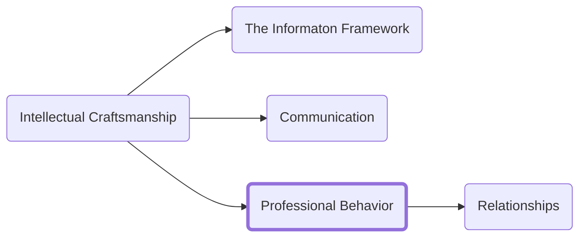

Your success individually will for a time early in your career rely heavily on your ability to manage the ‘hard’ parts of a job and the tools we have already covered about managing incoming information will help you to do those tasks effectively. Over time the portion of your job that relies on your individual abilities will decrease and you need to be prepared to handle those challenges as they come. This section (and the one proceeding it on communication) are tools for managing your career and the relationships you have with others.

<h3>Navigation</h3>

