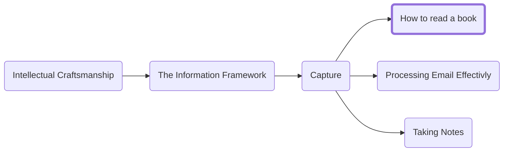

Books are the single most valuable places to source big ideas. The longer form allows more depth and lets the author present more interesting and complex arguments that would be difficult if not impossible in most other forms. In this section we will cover an approach for capturing information from books (although the approach should be applicable to other written content like articles as well). We will focus on capturing key concepts and ensuring a deep understanding of the text.

We will cover:

1.	Deciding what book to read
2.	Performing a survey pass
3.	Reading with a focus on analysis and capture
4.	When to stop reading

## Deciding what book to read

Before you dedicate time to a book, you need to be confident it will provide you with something valuable. With over 100,000 non-fiction titles published yearly it is obvious that many books do not provide a lot of value. Non-fiction especially, can fall into the trap of stretching one clever idea into a few hundred pages.

The method I will describe for active reading is rigorous and takes a lot of time. Because of the time commitment, it is essential that you ensure that the books you read are going to include ideas that are useful and actionable.

Once we finish a book, we will ask two questions:
1.	"Is it true?": Did the author produce a convincing argument.
2.	"So what?": Is there something you can do with the information. A beautifully written and researched book that convinced you that the sky is in fact green not blue is unlikely to change anything about your life. Being logically sound is not sufficient, a book (at least in this context) must give you tools or ideas to drive better action.

A book that is worth your time should have at least three ideas that are of value to you. As you perform a survey pass on the book look for things you think you would highlight or put into practice. Ideally every page has something valuable, but at minimum you should find at least three ideas that can instantly be put into practice or at minimum spark interest to explore further.

## Surveying a book
The first step to reading is to survey the concepts to start to build a mental map of the content the author intends to confer.
- Read the title
- Read the introduction
- Look at the graphics, charts, bold sections, headings etc.
- Read the conclusion

Because we generally are not following a narrative structure there is no concern in jumping ahead and getting an idea of what will be covered. This is also an excellent opportunity to decide whether a book is not worth your time.

As you survey, jot down any questions that come to mind as they will prove useful in the next section.

> A Note on Audiobooks:
> I am personally a massive fan of audiobooks and find I pick up concepts and information much better when listening than reading. They do come with some major downsides in that you cannot take notes in the margins or easily highlight, and it is more difficult to survey. Personally, I often listen to audiobooks I think will be valuable at 2x speed as a more in-depth form of survey and if I come out of the book with lots of value, I want to capture I purchase a copy and take a second path with a pen and highlighter to go more in depth.

## Reading with a focus on analysis and capture
Once you have built an initial mental model of what the author plans to cover it is time to start actively reading the book.

Before reading a chapter, pose a set of questions that come to mind based on your initial survey and use them to attempt to better understand the text. As you read continue to capture questions/answers that prove interesting.

Highlight passages that stand out to you. I recommend using two colors, one to represent ideas you agree with and the other to capture things you disagree with that need additional analysis or thought.

## When to Stop Reading
In the book world the term DNF (Did Not Finish) is used to denote a time when you did not complete a book. In school, you often learn to read to the end of a book even when it is no longer providing value. You need to re-train yourself to be ok with a DNF. You are not being graded on completion and it is not worth applying the above rigor to squeeze water out of a stone. When you reach a point weather during your initial survey or once activly reading that a book no longer is providing you value the best thing you can do is put it down and move on to another.

<h3>Navigation</h3>

