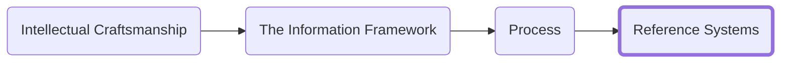

<h3>Navigation</h3>

```mermaid
graph LR;
  A(Intellectual Craftsmanship)-->B(The Information Framework)-->C(Process)-->D(Reference Systems)

  style D stroke-width:4px

  click A "{% post_url 2023-01-05-intro %}"
  click B "{% post_url 2023-01-05-info-framework %}"
  click C "{% post_url 2023-01-05-process %}"
```

|[Previous]()|[Next]()|