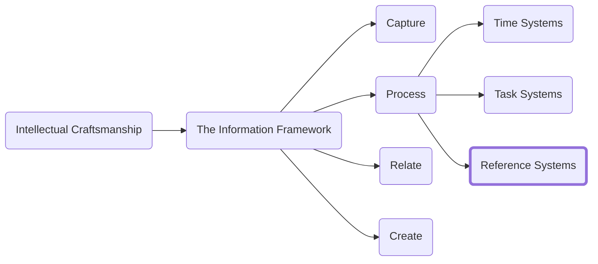

Most people maintain a calendar and some sort of Todo list but there is a third system that can set you apart from your peers. If you can create an effective reference system, you will be able to innovate and create at a pace that others cannot.

The system I will propose is best described as a thinking environment. While it is formed from written notes its purpose is to allow you to think and connect dispraise concepts. Writing facilitates thinking. Taking a source idea and capturing it in your own words will help you better understand the concepts and you will start to build a tool you can leverage

The method I will outline was first popularized by German academic Niklas Luhmann who famously used his reference system (called a "Zettelkasten" or "slip box") to allow him to write prolifically on a wide range of subjects. In all he published more than 70 books and more than 400 scholarly articles.

# The issue with existing reference systems
Before we cover the details of the system, I need to dedicate some time to explaining why I suggest taking on the challenge of creating your own slip box. The biggest downside of the system is that the process comes with some startup costs, and I want to make it clear why those costs are warranted.

Most people have some place where they keep reference material. You may have a OneNote or a notebook on your desk with notes from conferences and meetings in it. There are some fundamental issues with how most of those notes are formed that makes them significantly less useful.

Ineffective notes are tied to the context or source from which they were taken. This makes sense as a notetaker because it is optimized to make the process of capture easy. However, this approach becomes an issue at retrieval time. How likely are you to remember that an idea came out of the June 3rd session of a standing meeting series? If your plan is to leverage the information later (and why else take the notes in the first place), this is the notetaking equivalent of organizing your closet by what store the clothes were purchased from.

Because most notes are ineffective, we regularly build new things from scratch. 

# Hallmarks of a successful notetaking system
Effective notes are focused on a single concept. Rather than notes being just reminders of ideas, they are the ideas themselves encapsulated for later review and thought. Your goal should be to disconnect the idea from its context as much as possible. By extracting ideas from their context, we both increase our understanding of the idea and highlight the common themes across diverse sources. You can still reference the source it came from, but it will allow you to zoom out and find commonality and themes across ideas.

Effective notes are atomic. A single note should cover just one idea and conversely no atomic idea should span multiple notes. Creating atomic building blocks increase the utility of a note by allowing us to relate distraite ideas together

Conformation bias happens when our brains look for data and information that align with our own worldview or perspective. It is particularly problematic when trying to make a point because we are naturally inclined to limit our research to only sources that support us. 

This method of notetaking prevents bias because unlike traditional writing where the first step is posing a hypothesis and then research is done to learn about that topic, we instead focus on the research first and hypothesis and theories come from insight driven from the relationship between notes and concepts.

Not only does it prevent conformation bias (since you have no theory to conform to) your notes will improve the more dissenting opinions are applied because each new idea generates new interesting and diverse thinking.

<h3>Navigation</h3>

