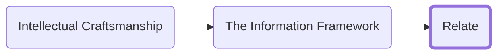

<h3>Navigation</h3>

You should now have the core guidelines to start to extract ideas from your raw captured notes to translate them into atomic concept focused notes. How do we structure and organize those notes to get the most out of them?

There are three core concepts to get the most out of your notes:
1.	Link your notes together to highlight the relationships and unlock insight and wisdom.
2.	Create categories through relationship rather than hierarchy
3.	Categorize your notes

Link your notes together to highlight the relationships and unlock insight and wisdom

As you create your atomic notes you will start to see relationships between them and expressing those relationships is where the real power of this system is unlocked.

Our raw captured idea notes are data. There is value in them, but we have not yet been able to extract that value. The first steps of pulling out core concepts and translating those ideas into our own words in a single atomic description is turning that data into information. You enrich the data and, in the process, you learn more about the concepts because writing is in many ways a form of thinking.

To use that information, we must assess it and identify the patterns and relationships between ideas and then find an expressive way of representing those relationships so we can better make connections.

For capturing those relationships, I recommend starting with a software program that can represented bi-directionally linked notes. Bi-directional means you can see not only what a note links to but what references it. Obsidian, Roam, Notion, and Logseq (I personally use Obsidian) are all good places to start.

TODO: Draw diagram for:
=============================================================
Data (Raw information) 
Information (An understanding of the types of data you have) 
Knowledge (An understanding of the relationships between ideas) 
Insight (the recognition that ideas are related in some way) 
Wisdom (an understanding how those ideas are related)
=============================================================

## Create categories through relationship rather than hierarchy
It is human nature to structure the world based on hierarchical taxonomies that put artificial constraints on how data is related. It will stop you from making interesting, interrelated dependency relationships between the information you consume.

Instead of attempting to coerce notes in a folder structure or other hierarchy we identify categories and relationships by organizing through the association between ideas. This reduces decision fatigue and avoids a rigid structure from allowing you to express interesting relationships. You can find insights bottom up which avoid you backing yourself into a metaphorical corner. You can find patterns in your thoughts first and categorize those patterns naturally by relating them. 

By relying only on relationships to define groupings you can relate ideas that might otherwise seem to come from different domains. One common place this comes up is when you find an insight from one industry and apply it to another such as the development of DevOps out of Lean Manufacturing techniques. In a strict hierarchy it may be difficult to identify let alone represent the relationship across industries in that way.

Tools like Obsidian have visual ‘maps’ of your notes that can highlight the structural grouping that form because of the relationships.

> Note: This guidance is focused on notes in your reference system. Task and project tracking require a hierarchical taxonomy because of the natural relationship between the tasks and the projects they accrue to. We discussed more on the task to project relationship in the Task Systems section.

Once you have a sufficiently large corpus of notes it can prove useful to create launchpad notes that link to a few good starting points for exploring a cluster of notes. These do not attempt to create a taxonomy but rather provide entry points to avoid letting your notes become a black hole.

## Categorize your notes
Now that you are focusing on the taxonomic approach to note organization I will introduce a caveat. It is valuable to separate notes into a few core categories.

I personally separate my notes into a four distinct categories:
1. __Raw Notes__: General idea inboxes, notes taken from books, podcasts, movies, YouTube videos etc. I dedicate some of my processing time to flushing out these ideas and use them as inspiration for what to research and learn next.
2. __Ideas__: These are processed notes that have some basic details but require flushing out before they would be usable in creation. Sometimes these notes are fully flushed out but lack relationships to other ideas in the graph. I use processing time to flush them out and relate them to other ideas.
3. __Permanent Notes__: These notes have been densely linked and capture an idea well. They can (and should) still be modified as you learn information or adjust your views, but they serve as the building blocks for future projects
4. __Projects__: I tend to form most of my projects in my slip box first. Having an archive of ways, the ideas have come together is extremely useful and the ability to link back to sources to quickly pull up the full note context regularly proves valuable.

|[Previous]()|[Next]()|