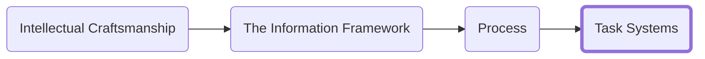

<h3>Navigation</h3>

I will start by saying I am not a believer in to-do lists in their traditional form. To-do lists too often become a list of aspirations and goals rather than a set of actions to be taken. By leaving the ‘tasks’ too large you can quickly become overwhelmed and the path forward with a given task can become unclear.

## Get Granular
Most of the time if you are putting off work that needs to be done it is because you have not figured out what the work is. You might have a goal in mind, but that goal has no action. Your brain is easily overwhelmed by it, and you will keep putting it back on your mental bookshelf and never get to doing it. To make any progress we need to think about what the concrete actions are that are required to move to the next step. We break it down into tasks so simple that there are no questions that need answers.

To illustrate the principal let us look at an example. In this hypothetical I need to hire a new receptionist for my business, and I have been putting it off for months. How would we approach this problem? My action is explicitly not "hire a new receptionist for my business." There is no single step or action you can take to get that done.

Start by writing down the first concrete step you and think of that is necessary to accomplish the project. In this case something like "interview candidates for receptionist position." It does not have to be the first step or the last, the goal is to give ourselves a jumping off point. Next, we start to move backwards in time. We go backwards because it is more important to know how to start the work than how to end it. Both are required but not with the same level of urgency and you will not always possess all the knowledge at the beginning of a project that will be needed to define the later steps. So, in our example: I cannot interview candidates if no one has applied. I cannot have applicants if I have not posted the position. I cannot post the position until I write the job description. So, to start working on the task of hiring a new receptionist the actual work is "write job description." This example assumes there are no unknowns about the job description process (e.g., "where did I put my laptop", "what qualifications am I looking for", etc.). If there were, we would add additional tasks to make sure everything is covered. 

For every single one of these steps that you define make sure there are no more questions to answer. The goal is to make sure that you do not have any doubt about what is next. Doubt leads to procrastination, guilt, and stress. If you cannot answer what the next concrete step, you can take is then write down a task to research more to determine the correct approach to the task. This process can feel heavy handed. That is by design. In time you may be able to write tasks with implied precursors but start by writing down everything. You can always scale back, but you must start training your mind to accept the patterns and lose the stress. Use your best judgement on where the cutoff is. 

Now that we have the "backwards" steps defined move forward from the original task we started with and define any other tasks you know about that will be required to reach the goal. In our example this would be something like "prepare new hire paperwork" and "speak with James about being a mentor". You do not have to be exhausted at this point because you will be re-reviewing all these tasks to determine what needs to be modified and what other tasks need to be added.

## Create Projects
I recommend grouping tasks into projects. If you have made your tasks sufficiently granular in the previous step it can be difficult to determine the priority of the individual tasks so by grouping them, you can work on those items that accrue to the most important project.

## Deciding what to work on
For determining what next action is appropriate I recommend using the Eisenhower Matrix. Adapted by Stephen Covey in his best-selling book The 7 Habits of Highly Effective People, the Eisenhower Matrix is an approach for determining next action.

The matrix has you assess each task for its urgence and its importance to determine what actions should be taken. The goal is to reduce the amount of time you spend in reactive mode. Some reactivity is unavoidable but if you are always in the lower left-hand quadrant then you will have to start saying no to more things to ensure your essential work gets completed.

You will often find other people come to you with things that are urgent but are of low importance (at least relevant to your core priorities.) While there is value in bailing people out, remember to assess the importance before assuming that urgency should drive action.

| | URGENT | NOT URGENT |
|------|--------|----------|
| I M P O R T A N T |☑️ Do It   Tasks with tight deadlines that have  consequences for not completing       Example:  - Submitting a grant proposal before it's due | 📅Schedule It   Tasks that are valuable but less time   constrained. These tasks are easy to   procrastinate so schedule time for them    Example:  - Updating your Resume|
| N O T  I M P O R T A N T |❔Question It  Here be dragons. Approach these tasks with caution.   If the urgency cannot be reduced, then look for   opportunities to delegate the work.   Example:  - Responding to emails | 🗑️Drop It  These tasks only serve to distract. Take the time you   would have dedicated to them and put it towards   a task that needs doing.  Example: - An email not addressed to you that  you don't have a ready answer for|

|[Previous]()|[Next]()|